# Sistem Klasifikasi Citra Sayur untuk Mendukung Pola Makan Sehat 👩🏻‍🍳🌽

## Overview Project
Sayuran adalah salah satu komponen utama dalam pola makan sehat karena kaya akan nutrisi, termasuk vitamin, mineral, serat, dan antioksidan. Namun, banyak orang menghadapi tantangan dalam mengenali jenis-jenis sayuran dan memahami manfaat nutrisinya. Proyek ini bertujuan untuk mengembangkan Sistem Klasifikasi Citra Sayur berbasis kecerdasan buatan sebagai alat edukasi untuk mendukung pola makan sehat.

Link Dataset yang digunakan [Dataset_Vegetables](https://www.kaggle.com/code/chitwanmanchanda/vegetable-image-classification-using-cnn?kernelSessionId=84747681)
Preprocessing yang digunakan yaitu Resize, Normalisasi, dan Augmentasi. Dan model yang digunakan yaitu MobileNetV2 dan InceptionV3.

**InceptionV3 Architecture**

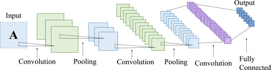

**MobileNetV2 Architecture**

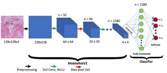

## Overview Dataset
Dataset yang digunakan adalah Klasifikasi Sayuran dengan link sebagai [berikut](https://www.kaggle.com/code/chitwanmanchanda/vegetable-image-classification-using-cnn?kernelSessionId=84747681). Dataset terdiri atas 21000 gambar yang terbagi menjadi 70% sebagai Training Set, 15% sebagai Validation Set, dan 15% sebagai Testing Set, dimana pada setiap Set, terdapat 15 Label Class yaitu Bean, Bitter Ground, Bottle Ground, Brinjal, Broccoli, Cabbage, Capsicum, Carrot, Cauliflower, Cucumber, Papaya, Potato, Pumpkin, Radish, Tomato.

## Preprocessing & Modelling 

### MobileNetV2 Model
Preprocessing

Preprocessing yang dilakukan antara lain adalah resizing (224, 224), lalu rescale / normalization dengan rentang 1./255, dilanjut dengan melakukan splitting dataset menjadi 3 (Training, Validation, dan Testing) sesuai dengan penjelasan pada Dataset.

Modelling
Hasil dari CNN Model yang telah dibangun sebagai berikut : 

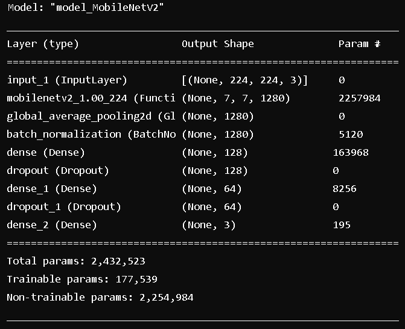

Model Evaluation
Berikut adalah hasil dari MobileNetV2 Model yang telah dibangun :

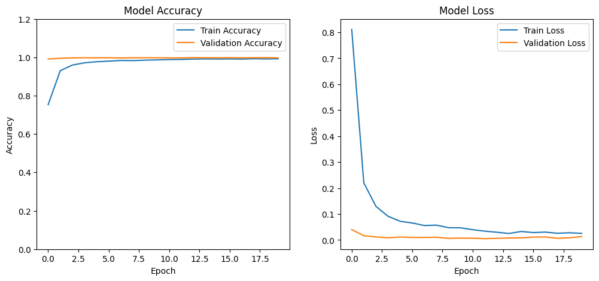
Pada train Acc dilihat terus meningkat seiring bertambahnya epoch dan di akhir pelatihan nilai akurasi mendekati 1.0 sehingga model hampir sepenuhnya memprediksi dengan benar. Akurasi pada data validasi juga terus meningkat dengan stabil sehingga tidak menunjukkan model overfitting.

Pada train Loss grafis terus menurun setiap epoch bertambah dan nilai akhir yang sangat kecil membuat model dapat meminimalisisr kesalahan prediksi. Hal serupa pada Validation Loss.

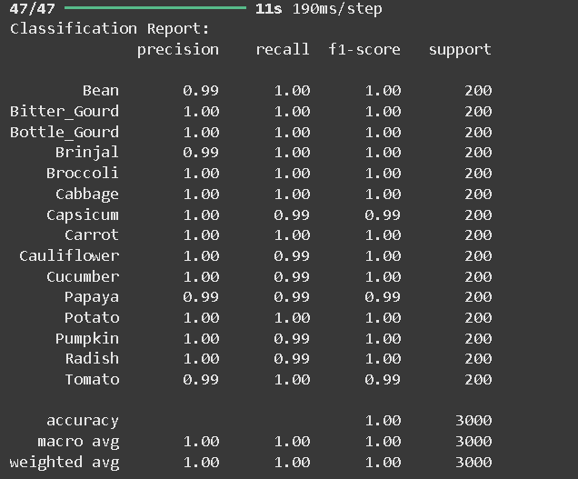

Gambar diatas merupakan Classification Report dari model setelah dilakukan Predict. Dilihat akurasi yang mencapai angka sempuran yaitu 100%

### InceptionV3 Model
Preprocessing

Preprocessing yang dilakukan antara lain adalah resizing (224, 224), lalu rescale / normalization dengan rentang 1./255, lalu melakukan augmentasi. Setelah augmentasi selesai dilakukan, langkah terakhir adalah splitting dataset menjadi 3 (Training, Validation, dan Testing) sesuai dengan penjelasan pada Dataset.

Modelling

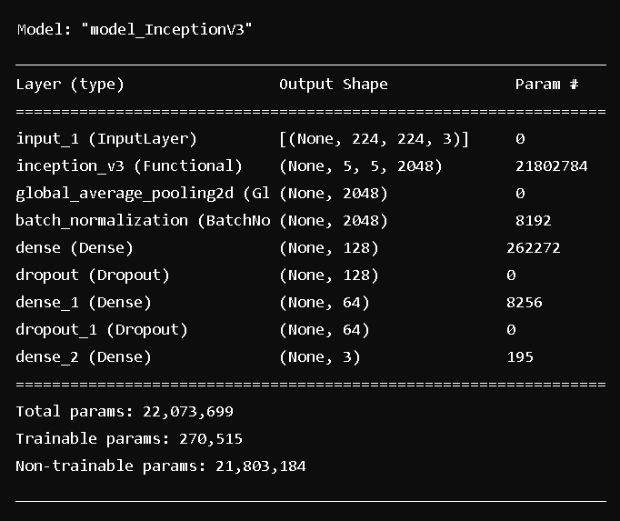

Model Evaluation
Berikut adalah hasil dari InceptionV3 Model yang telah dibangun :

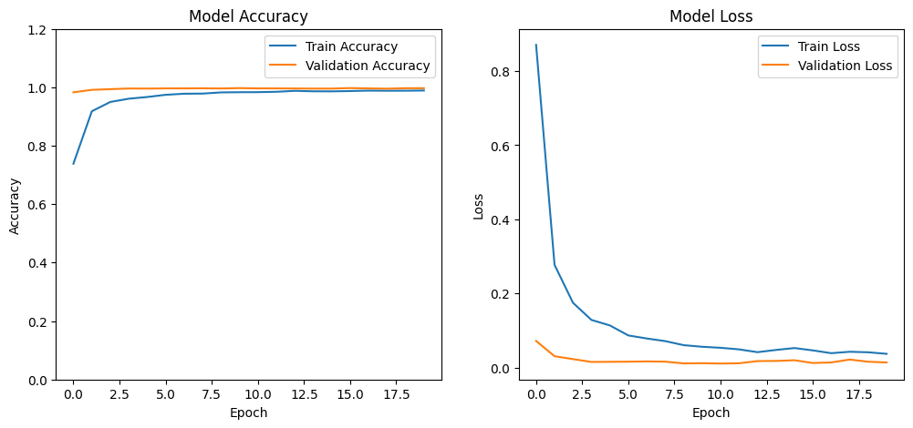
Pada evaluasi model ini dapat dilihat bahwa grafik model ini hampir memiliki persamaan dengan model MobileNetV2 yaitu mendekati sempurna baik dari Train dan Validation Acc serta Train dan Validation Loss.

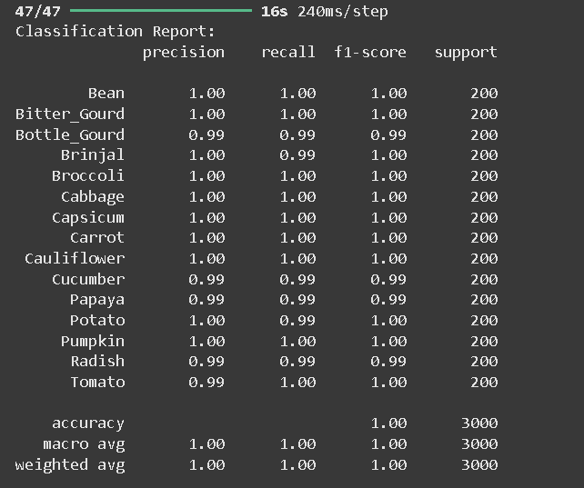

Gambar diatas merupakan Classification Report dari model setelah dilakukan Predict. Dilihat akurasi yang mencapai angka sempuran yaitu 100%

## Local Web Deployment

### Tampilan HomePage

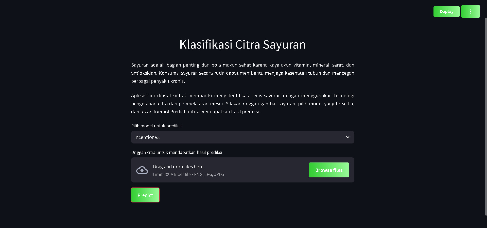

### Tampilan Setelah Upload Image

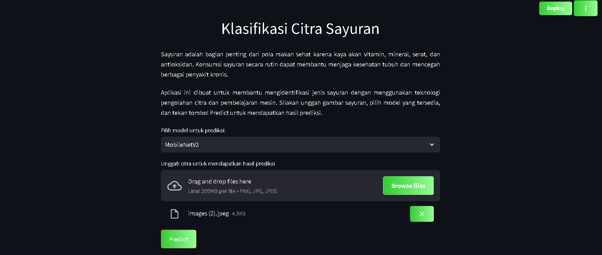

### Tampilan Prediction result

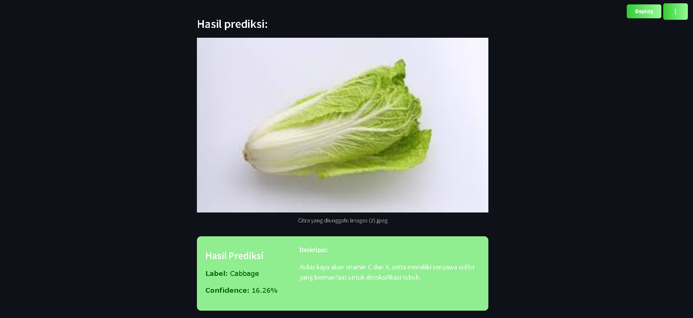

### Author

